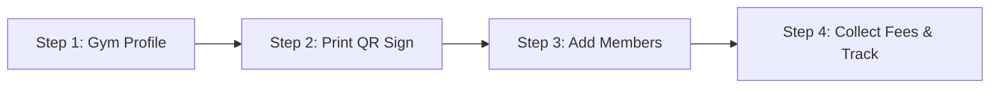

# 🏋️ Ironline Gym Management System — Gym Owner's Complete Operating Manual

> **Welcome to Ironline!**  
> This comprehensive guide walks you through every feature of the Ironline Gym Management System. Designed specifically for modern gym owners, this platform streamlines your front desk operations, automates monthly fee collections, manages trainers, tracks member workouts and diets, and delivers a branded mobile app experience to your members.

---

## 📑 Table of Contents
1. [Platform Overview & Key Highlights](#1-platform-overview--key-highlights)
2. [Quick-Start Guide (Setup Your Gym in 5 Minutes)](#2-quick-start-guide-setup-your-gym-in-5-minutes)
3. [White-Label Branding & Member App Install](#3-white-label-branding--member-app-install)
4. [Smart Reception Check-In System](#4-smart-reception-check-in-system)
   - [Zero-Click Phone Camera Scan](#zero-click-phone-camera-scan)
   - [Offline-First Check-In (No Internet Required)](#offline-first-check-in-no-internet-required)
   - [Midnight Calendar Rollover](#midnight-calendar-rollover)
   - [Printable Reception Desk Sign](#printable-reception-desk-sign)
   - [Manual Front-Desk Check-In](#manual-front-desk-check-in)
5. [Member Management (Customers)](#5-member-management-customers)
6. [Monthly Fee & Revenue Management](#6-monthly-fee--revenue-management)
   - [Fee Statuses (Paid, Due Soon, Overdue)](#fee-statuses-paid-due-soon-overdue)
   - [Collecting Payments (Cash, Card, Bank)](#collecting-payments-cash-card-bank)
   - [1-Click Bulk Monthly Invoicing](#1-click-bulk-monthly-invoicing)
   - [Payment Receipts & Export](#payment-receipts--export)
7. [Streaks, Badges & Member Retention Engine](#7-streaks-badges--member-retention-engine)
   - [Attendance Streaks & Milestone Badges](#attendance-streaks--milestone-badges)
   - [1-Day-Per-Week Rest Day Protection](#1-day-per-week-rest-day-protection)
8. [Workouts, Diets & Body Progress Tracking](#8-workouts-diets--body-progress-tracking)
   - [Custom Workout Builder & Routines](#custom-workout-builder--routines)
   - [Nutrition & Meal Plans](#nutrition--meal-plans)
   - [Body Weight & Transformation Logs](#body-weight--transformation-logs)
9. [Trainer & Staff Delegation](#9-trainer--staff-delegation)
10. [Announcements & Member Communication](#10-announcements--member-communication)
11. [Business Analytics & Peak Hours](#11-business-analytics--peak-hours)
12. [Frequently Asked Questions (FAQ) & Troubleshooting](#12-frequently-asked-questions-faq--troubleshooting)

---

## 1. Platform Overview & Key Highlights

Ironline provides you with an all-in-one digital operating system for your gym:

- **100% Isolated Data**: Your members, fee records, trainers, and financial data are strictly private and accessible only by you.
- **Custom Gym Branding**: Your gym's name and logo appear on the top header, sidebar, login portal, and on members' phones.
- **No Hardware Turnstile Required**: Run high-speed check-ins using any smartphone camera with our smart QR desk sign.
- **Offline Reliability**: Continues functioning in basement gyms without cellular coverage.
- **PKR Localized Billing**: Tailored for direct monthly subscription fees with cash, bank transfer, and mobile wallet tracking.
- **Zero App Store Hassle**: Members install your app directly onto their iPhone or Android home screen with a single tap (Progressive Web App).

---

## 2. Quick-Start Guide (Setup Your Gym in 5 Minutes)

Follow these 4 simple steps to get your gym up and running today:

1. **Set Up Gym Profile**: Go to **Gym Profile** in your sidebar. Enter your Gym Name, Phone Number, Operating Hours, Address, and upload your Gym Logo.
2. **Print Reception Desk Sign**: Under Gym Profile, click **"Print Reception Sign"**. Place this printed sign on your front counter.
3. **Add Your First Members**: Go to **Customers** -> Click **"+ Add Customer"**. Fill in their name, username, phone, and monthly fee.
4. **Distribute Member App**: Have members scan your gym's QR sign. Their phone will prompt them to install the app and log in!

---

## 3. White-Label Branding & Member App Install

Your members will experience a fully customized app tailored to your gym:

### Custom Gym Name & Logo Display
- **App Topbar & Sidebar**: Displays your gym's official name (e.g. `TITAN FITNESS`) and emblem at the top of every screen on both desktop and mobile.
- **Login Portal**: When members open your app, they see:
  - *"Welcome to [Your Gym Name]. Your fitness home."*
  - Your gym's emblem and branding colors.
  - One-tap sign in to your member portal.

### Dedicated Gym Install Link (`/g/your-gym-name`)
- Every gym receives a unique URL slug (e.g., `yourapp.com/g/titan-fitness`).
- When members open this link on iPhone (Safari) or Android (Chrome), a banner prompts:
  > **"Install [Your Gym Name] App on your phone"**
- Tapping install adds your gym's icon directly to their phone's home screen alongside Instagram and WhatsApp.

---

## 4. Smart Reception Check-In System

The check-in system is engineered for zero friction and high reliability.

### Zero-Click Phone Camera Scan
1. The member opens their standard phone camera (iOS Camera or Android Google Lens).
2. They point their camera at your Reception Desk QR Code.
3. A notification banner pops up: *"Open in [Your Gym Name]"*.
4. **Result**: The app opens and **instantly confirms check-in with 0 clicks** (no buttons to press, no pins to enter).
5. The screen displays:
   > **"Checked In! Streak: 14 Days 🔥"**

### Offline-First Check-In (No Internet Required)
Gym basements often suffer from poor cellular reception. Ironline solves this completely:
- If a member scans when their phone has **No Internet / No Mobile Signal**:
  - The check-in is saved instantly into local device storage.
  - The member sees: `🟡 Check-In Queued (Offline) — Recorded locally. Will sync when online.`
  - The member can enter the gym immediately without holding up the line.
- **Automatic Background Sync**: The second the member connects to gym WiFi or steps outside into cell service, the visit automatically uploads to your dashboard with the exact timestamp.
- The status turns to: `🟢 Synced with gym servers! Streak verified 🔥`.

### Midnight Calendar Rollover
- Traditional systems use a 24-hour rolling timer, which causes confusion when members visit twice on the same day.
- Ironline refreshes the check-in token **at midnight (23:59:59)** of each calendar day.
- A member can check in once each calendar day, perfectly matching real gym operating hours.

### Printable Reception Desk Sign
- In your **Gym Profile** tab, click **"Print Reception Sign"**.
- This generates an elegant, high-contrast, ready-to-print 8.5x11 / A4 sign displaying:
  - Your Gym Name & Emblem.
  - High-resolution check-in QR code.
  - Today's Backup Passcode (for members whose phone cameras may be damaged).
  - Clear instructions: *"Valid for Today · Refreshes at Midnight"*.

### Manual Front-Desk Check-In
If a member forgot their phone at home:
- Open your **Attendance** tab on the reception computer or tablet.
- Type the member's name or username in the quick-search box.
- Click **"Check In"** — their attendance and streak update immediately.

---

## 5. Member Management (Customers)

Your **Customers** page provides full lifecycle management of your gym's membership base:

| Feature | Description |
| :--- | :--- |
| **Add Member** | Register member with Name, Phone, Email, Username, Password, Emergency Contact, and Fitness Goals. |
| **Membership Status** | Instantly filter members by `Active`, `Inactive`, `Due Soon`, or `Overdue`. |
| **Assign Trainer** | Link a member to a specific personal trainer so the trainer can view their workouts and diet. |
| **Password Reset** | If a member forgets their credentials, generate a temporary password or reset it in 1 click. |
| **Member Details Drawer** | View complete attendance history, fee payment records, workout logs, and weight charts in one side panel. |
| **Bulk Actions** | Select multiple members to send bulk announcements or generate fees simultaneously. |

---

## 6. Monthly Fee & Revenue Management

Ironline uses a straightforward monthly subscription model tailored to private gym finances.

### Fee Statuses
Each member's fee status is automatically computed:
- 🟢 **Paid**: Monthly fee is fully settled; active membership period is in the future.
- 🟡 **Due Soon**: Payment is due within the next 5 days.
- 🔴 **Overdue**: Due date has passed and payment has not been received.
- ⚪ **Unpaid**: Newly issued fee invoice awaiting payment.

### Collecting Payments (Cash, Card, Bank)
When a member pays their monthly fee at reception or via bank:
1. Open **Fees** -> Locate the member or click **"+ Record Payment"**.
2. Enter the amount (e.g., `PKR 5,000`).
3. Select the payment method:
   - **Cash** (Reception desk)
   - **Bank Transfer** (Direct account deposit)
   - **Card / POS** (Debit/Credit swipe)
   - **Mobile Wallet** (JazzCash / EasyPaisa / Raast)
4. Enter any optional payment reference or receipt number.
5. Click **"Save Payment"**. The member's status instantly updates to `Paid` and their renewal date advances by 1 month.

### 1-Click Bulk Monthly Invoicing
At the start of each month:
- Go to **Fees** -> Click **"Bulk Generate Invoices"**.
- The system automatically creates new fee invoices for all active gym members based on their individual monthly rate.
- Saves hours of manual bookkeeping.

### Financial Summary Cards
The top of your Fees dashboard displays live financial summaries:
- **Total Revenue Collected** (This Month)
- **Pending Dues** (Awaiting collection)
- **Overdue Amount** (Late payments requiring follow-up)
- **Collection Rate** (% of members up to date)

---

## 7. Streaks, Badges & Member Retention Engine

Member retention is the #1 growth driver for gyms. Ironline turns consistent gym attendance into an engaging habit.

### Attendance Streaks & Milestone Badges
- Every time a member checks in on consecutive days, their **Workout Streak** increases (+1 day).
- As their streak grows, they automatically unlock milestone badges on their profile:
  - 🥉 **7-Day Bronze Warrior**
  - 🥈 **30-Day Silver Dedicated**
  - 🥇 **100-Day Gold Elite**
  - 💎 **365-Day Iron Legend**

### 1-Day-Per-Week Rest Day Protection
Real lifters need recovery! If a member takes Sunday off, they shouldn't lose their 25-day streak:
- The system includes a built-in **1-Day-Per-Week Rest Day Allowance**.
- If a member skips 1 day (e.g., 48 hours between visits), the system checks their rest day history:
  - If they haven't used their rest day in the last 7 days, **their streak is safely preserved**!
  - The member is congratulated: *"Weekly Rest Day Protection Applied! 🛡️ Streak continues safe!"*
- If a member misses 2 or more days in a row, the streak resets to 1 to maintain motivation and integrity.

---

## 8. Workouts, Diets & Body Progress Tracking

Provide immense value to your members beyond just access to weights:

### Custom Workout Builder & Routines
- Under **Workouts**, create standardized gym templates (e.g. *Beginner Push-Pull-Legs*, *Upper/Lower Split*, *Fat Loss Circuit*).
- Specify exercise names, sets, target reps, weight, and rest times.
- Assign these routines directly to individual members. Members can open their phone app on the gym floor and log their weights.

### Nutrition & Meal Plans
- Under **Diet**, create balanced nutritional blueprints.
- Break down meals into Breakfast, Mid-Morning Snack, Lunch, Pre-Workout, Dinner, and Post-Workout.
- Include caloric targets, protein, carb, and fat breakdowns.
- Members view their personalized diet plan right inside their app.

### Body Weight & Transformation Logs
- Record member weigh-ins, body fat percentage, and measurements over time.
- Interactive charts visually display weight loss or muscle gain trends.
- Keeps members accountable and proves that your gym gets them real results!

---

## 9. Trainer & Staff Delegation

If your gym employs personal trainers or floor coaches:

- **Trainer Accounts**: Create logins for your trainers under the **Trainers** tab.
- **Client Assignment**: Assign specific members to specific trainers.
- **Trainer Portal**: When a trainer logs in, they only see their assigned clients. They can:
  - Log workout programs for their clients.
  - Update their clients' diet plans.
  - Schedule 1-on-1 personal training sessions.
- **Owner Supervision**: As the gym owner, you retain full visibility over all trainers and their clients.

---

## 10. Announcements & Member Communication

Keep your gym community informed without maintaining messy WhatsApp group chats:

- Go to **Announcements** -> Click **"New Announcement"**.
- Compose your message (e.g., *Eid Holiday Timings*, *New Cardio Equipment Installed*, *Upcoming Powerlifting Meet*).
- Choose your audience: All Members, Active Only, or Staff.
- Click **"Broadcast"**. The message instantly displays as an in-app banner and notification across all member dashboards.

---

## 11. Business Analytics & Peak Hours

Make data-backed decisions to grow your gym:

- **Peak Attendance Heatmap**: Discover which hours of the day are busiest (e.g., 6:00 PM – 8:30 PM). Use this to schedule floor trainers or manage equipment traffic.
- **Busiest Days of the Week**: Identify whether Monday or Tuesday has peak volume vs quiet weekend hours.
- **Member Retention Trends**: Track active members vs churn rate month-over-month.

---

## 12. Frequently Asked Questions (FAQ) & Troubleshooting

#### Q: How do members install the app on their phone without the App Store or Google Play?
**A:** Ironline is built as a Progressive Web App (PWA). When members scan your reception QR code or visit `yourapp.com/g/your-gym-name`, their mobile browser automatically displays an **"Install App"** prompt. 
- On **Android (Chrome)**: Tap *"Install App"* -> The icon is added to their home screen.
- On **iPhone (Safari)**: Tap the Share button (square with arrow) -> Select *"Add to Home Screen"*.

#### Q: What if our gym basement has no mobile signal or the internet router goes down?
**A:** The check-in system continues working seamlessly offline! Members can scan the reception QR code using the in-app camera or native camera. The visit is safely recorded on their phone and automatically syncs to your gym dashboard the moment connectivity is restored.

#### Q: Can a member share their check-in QR code screenshot with a friend outside?
**A:** No. The QR code on your reception desk sign is a **Desk Sign QR**, meaning the member must be physically present at your desk to scan it. Furthermore, the token automatically refreshes each calendar day.

#### Q: Can I change a member's monthly fee amount?
**A:** Yes! Open the member's profile under **Customers**, edit their `Monthly Fee` field, and save. All future monthly invoices generated for that member will automatically use the new rate.

#### Q: How does the weekly rest day streak protector work?
**A:** If a member misses 1 day of gym attendance (for example, taking Sunday off), the system will not reset their streak to zero, provided they haven't used another rest day in the previous 7 days. If they miss 2 consecutive days, their streak will reset to 1.

---

### Need Support or Have Questions?
For assistance, feature requests, or technical support, contact the Ironline platform administrator or visit your **Settings** tab.

*Ironline — Empowering Gym Owners, Inspiring Athletes.*
